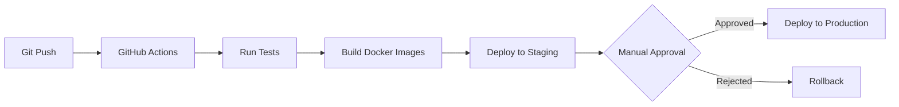

# AI Chief of Staff - Project Coordination

## 🎯 Project Overview

**Goal:** Build a complete AI Chief of Staff system with:
1. Video/Audio transcription capabilities
2. Tesla-worthy web application
3. Full integration between backend and frontend

**Timeline:** 3 weeks (April 17 - May 8, 2026)

---

## 👥 Team Structure

### Backend Team
**Lead:** Senior Backend Developer
**Deliverable:** Media extraction service
**Tech Stack:** Python, FastAPI, Whisper API, FFmpeg, Celery

### Frontend Team
**Lead:** Senior Frontend Developer
**Deliverable:** Web application
**Tech Stack:** Next.js 14, TypeScript, Tailwind CSS, shadcn/ui

### Integration Lead
**Role:** Coordinate API contracts, testing, deployment

---

## 📅 Sprint Schedule

### WEEK 1: Foundation (Apr 17-23)

#### Backend Tasks
- [ ] Day 1: Create media API endpoints (`/upload`, `/transcribe`, `/status`)
- [ ] Day 2: Integrate OpenAI Whisper API
- [ ] Day 3: Implement Celery async processing
- [ ] Day 4: Connect to existing AI pipeline
- [ ] Day 5: Testing and bug fixes

**Deliverables:**
- Working media upload endpoint
- Transcription working end-to-end
- Integration with existing processor

#### Frontend Tasks
- [ ] Day 1: Next.js project setup + design system
- [ ] Day 2: Landing page structure
- [ ] Day 3: Core component library
- [ ] Day 4: Live demo section
- [ ] Day 5: API integration layer

**Deliverables:**
- Landing page (static)
- Component library ready
- API client configured

---

### WEEK 2: Core Features (Apr 24-30)

#### Backend Tasks
- [ ] Day 1: Optimize transcription performance
- [ ] Day 2: Add error handling and retries
- [ ] Day 3: Implement caching layer
- [ ] Day 4: Add WebSocket support for progress
- [ ] Day 5: Documentation and testing

**Deliverables:**
- Production-ready media API
- Real-time progress updates
- API documentation updated

#### Frontend Tasks
- [ ] Day 1: Dashboard layout and routing
- [ ] Day 2: Text processing interface
- [ ] Day 3: Media upload UI
- [ ] Day 4: Results display components
- [ ] Day 5: Real-time updates integration

**Deliverables:**
- Functional dashboard
- Media upload working
- Connected to backend APIs

---

### WEEK 3: Polish & Launch (May 1-7)

#### Backend Tasks
- [ ] Day 1: Performance optimization
- [ ] Day 2: Security hardening
- [ ] Day 3: Rate limiting
- [ ] Day 4: Monitoring and logging
- [ ] Day 5: Production deployment

**Deliverables:**
- Optimized API (< 2s response)
- Security audit completed
- Deployed to production

#### Frontend Tasks
- [ ] Day 1: Analytics dashboard
- [ ] Day 2: Developer documentation pages
- [ ] Day 3: Animations and polish
- [ ] Day 4: Testing (E2E, accessibility)
- [ ] Day 5: Production deployment

**Deliverables:**
- Complete web application
- All features polished
- Deployed and live

---

## 🔗 Integration Points

### API Contract

#### Existing Endpoints (Already Working)
```
GET  /                        # Root
GET  /api/v1/health          # Health check
POST /api/v1/process         # Process text
```

#### New Media Endpoints (Backend Team)
```
POST /api/v1/media/upload           # Upload file
POST /api/v1/media/transcribe/:id   # Start transcription
GET  /api/v1/media/status/:id       # Check status
GET  /api/v1/media/result/:id       # Get results
```

#### WebSocket Endpoint (Backend Team)
```
WS /ws/processing/:job_id    # Real-time updates
```

### Shared Data Models

```typescript
// Task
interface Task {
  id: string;
  title: string;
  owner: string | null;
  deadline: string | null;
  priority: "low" | "medium" | "high";
  status: "pending" | "completed";
}

// Decision
interface Decision {
  id: string;
  decision: string;
  made_by: string;
  timestamp: string;
}

// Risk
interface Risk {
  id: string;
  risk: string;
  severity: "low" | "medium" | "high";
  mitigation: string | null;
}

// Processing Result
interface ProcessingResult {
  run_id: string;
  tasks: Task[];
  decisions: Decision[];
  risks: Risk[];
  summary: string;
}

// Media Upload
interface MediaUpload {
  media_id: string;
  filename: string;
  size_bytes: number;
  duration_seconds?: number;
  status: "uploaded" | "processing" | "completed" | "failed";
  created_at: string;
}

// Transcription Job
interface TranscriptionJob {
  job_id: string;
  media_id: string;
  status: "queued" | "processing" | "completed" | "failed";
  progress: number;
  transcription?: string;
  error_message?: string;
  processing_time_ms?: number;
}
```

---

## 📊 Daily Standup Format

**Time:** 9:00 AM daily
**Duration:** 15 minutes

### Agenda:
1. **Yesterday:** What did you complete?
2. **Today:** What will you work on?
3. **Blockers:** Any issues or dependencies?

### Slack Channel: #ai-chief-of-staff-dev

---

## 🧪 Testing Strategy

### Backend Testing
```bash
# Unit tests
pytest app/media/tests/

# Integration tests
pytest app/tests/integration/

# Load testing
locust -f tests/load/media_test.py
```

### Frontend Testing
```bash
# Unit tests
npm test

# Component tests
npm run test:components

# E2E tests
npm run test:e2e
```

### Integration Testing
```bash
# Full stack test
npm run test:integration
```

---

## 🚀 Deployment Strategy

### Environments

#### Development
- Backend: http://localhost:8000
- Frontend: http://localhost:3000
- Database: PostgreSQL local
- Redis: Redis local

#### Staging
- Backend: https://api-staging.aichief.dev
- Frontend: https://staging.aichief.dev
- Database: PostgreSQL (AWS RDS)
- Redis: Redis (AWS ElastiCache)

#### Production
- Backend: https://api.aichief.dev
- Frontend: https://aichief.dev
- Database: PostgreSQL (AWS RDS - Production)
- Redis: Redis (AWS ElastiCache - Production)

### Deployment Pipeline



---

## 📞 Communication Channels

### Slack Channels
- `#ai-chief-of-staff-dev` - Development updates
- `#ai-chief-of-staff-backend` - Backend team
- `#ai-chief-of-staff-frontend` - Frontend team
- `#ai-chief-of-staff-alerts` - System alerts

### Meeting Schedule
- **Daily Standup:** 9:00 AM (15 min)
- **Sprint Planning:** Mondays 10:00 AM (1 hour)
- **Demo Day:** Fridays 4:00 PM (30 min)
- **Retrospective:** Fridays 4:30 PM (30 min)

### Documentation
- **Specs:** `/docs/media-extraction-spec.md`, `/docs/webapp-spec.md`
- **API Docs:** http://localhost:8000/docs
- **Component Docs:** http://localhost:3000/storybook

---

## 🎯 Success Metrics

### Backend Metrics
- ✅ Upload success rate: > 99%
- ✅ Transcription accuracy: > 95%
- ✅ Processing time: < 2 seconds
- ✅ API uptime: > 99.9%

### Frontend Metrics
- ✅ Lighthouse score: > 90
- ✅ First Contentful Paint: < 1.5s
- ✅ Time to Interactive: < 3.5s
- ✅ Mobile responsiveness: 100%

### Business Metrics
- ✅ Developer engagement: > 100 API calls/day
- ✅ Demo conversions: > 20%
- ✅ User satisfaction: > 4.5/5 stars

---

## 🐛 Issue Tracking

### Priority Levels
- **P0:** Critical (production down)
- **P1:** High (major feature broken)
- **P2:** Medium (minor bug)
- **P3:** Low (enhancement)

### Bug Report Template
```markdown
**Title:** Brief description

**Priority:** P0/P1/P2/P3

**Description:**
What happened?

**Steps to Reproduce:**
1. Step 1
2. Step 2
3. Step 3

**Expected:** What should happen
**Actual:** What actually happened

**Environment:**
- Browser/OS:
- Version:

**Screenshots:**
[If applicable]
```

---

## 📝 Change Log

### Version 1.0.0 (Target: May 7, 2026)
- [x] Text processing (existing)
- [x] Slack integration (existing)
- [ ] Media transcription (new)
- [ ] Web application (new)
- [ ] Real-time updates (new)
- [ ] Analytics dashboard (new)

---

## 🔒 Security Checklist

### Backend
- [ ] HTTPS enforced
- [ ] API rate limiting
- [ ] Input validation
- [ ] File upload size limits
- [ ] CORS configuration
- [ ] Authentication (future)

### Frontend
- [ ] HTTPS enforced
- [ ] XSS protection
- [ ] CSRF tokens
- [ ] Input sanitization
- [ ] Secure cookie settings
- [ ] Content Security Policy

---

## 📚 Resources

### Backend Resources
- [OpenAI Whisper API Docs](https://platform.openai.com/docs/guides/speech-to-text)
- [FFmpeg Documentation](https://ffmpeg.org/documentation.html)
- [FastAPI Best Practices](https://fastapi.tiangolo.com/)
- [Celery Documentation](https://docs.celeryq.dev/)

### Frontend Resources
- [Next.js 14 Docs](https://nextjs.org/docs)
- [shadcn/ui Components](https://ui.shadcn.com/)
- [Tailwind CSS Docs](https://tailwindcss.com/docs)
- [Framer Motion](https://www.framer.com/motion/)

### Design Resources
- [Tesla Website](https://www.tesla.com/) - Design inspiration
- [Dribbble - Dashboard Designs](https://dribbble.com/tags/dashboard)
- [Awwwards](https://www.awwwards.com/) - Web design inspiration

---

## 🎉 Launch Checklist

### Pre-Launch (1 week before)
- [ ] All features complete
- [ ] All tests passing
- [ ] Security audit completed
- [ ] Performance optimization done
- [ ] Documentation complete
- [ ] Staging environment stable

### Launch Day
- [ ] Deploy to production
- [ ] Monitor error rates
- [ ] Check performance metrics
- [ ] Announce on social media
- [ ] Update documentation
- [ ] Send launch email

### Post-Launch (1 week after)
- [ ] Collect user feedback
- [ ] Fix critical bugs
- [ ] Monitor usage metrics
- [ ] Plan next features
- [ ] Retrospective meeting

---

## 📧 Contact

**Project Manager:** [Your Name]
**Backend Lead:** Senior Backend Developer
**Frontend Lead:** Senior Frontend Developer

**Questions?** Post in `#ai-chief-of-staff-dev` or email team@aichief.dev

---

**Last Updated:** April 17, 2026
**Next Review:** April 20, 2026
